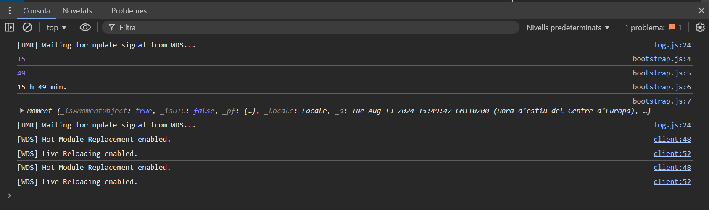

**Contenido:**

1. [¿Qué es un paquete NPM?](#qué-es-un-paquete-npm)
1. [¿Qué es Moment JS?](#qué-es-moment-js)
1. [¿Por qué es importante la gestión de errores?](#por-qué-es-importante-la-gestión-de-errores)

### ¿Qué es un paquete NPM? 

NPM (Node Package Manager) es a su vez un repositorio en línea de software (registro NPM) y un sistema de gestión e Instalación de paquetes incluido por defecto en el entorno de programación para JS denominado Node.js. 

Desarrolladores de todo el mundo pueden crear y albergar online paquetes NPM, es decir, agrupaciones de código JS que permiten extender las funcionalidades de un código o aplicación sin la necesidad de que el programador desarrolle las funcionalidades él mismo. Los paquetes de código pueden albergarse de manera gratuita en repositorios NPM públicos o de pago si su desarrollo es con fines privados. Esta vertiente de NPM se ha desarrollado a tal punto que el registro NPM se considera como el mayor repositorio de software del mundo. 

La instalación de paquetes del registro NPM en un entorno local se realiza mediante el cliente NPM a través de la línea de comandos. Las dependencias del proyecto en desarrollo se incluyen dentro del fichero “package.js” el cual está escrito en JSON (JavaScript Object Notation) e incluye el nombre de los paquetes requeridos y la versión de los mismos. 

Un ejemplo de paquetes NPM muy populares son el paquete Lodash y el paquete Moment.js. Este último se presenta un poco más detalladamente en la pregunta siguiente.

### ¿Qué es Moment JS?

Moment.js es una librería para trabajar con fechas. Permite parsear, validar, manipular y dar formato a fechas. La utilización de esta librería simplifica el desarrollo de código de un proyecto puesto que proporciona herramientas para trabajar con las fechas. 

Una vez instalada en el ambiente de desarrollo local, podemos usar las funcionalidades proporcionadas por *Moment.js* añadiendo `import moment from ‘moment’`. Una vez importado podemos usar las numerosas herramientas proporcionadas por esta librería. Por ejemplo, tal y como se muestra en el ejemplo siguiente, podemos almacenar la fecha en una variable usando la función `moment()`. Una vez guardada la fecha y la hora, podemos, por ejemplo, visualizar varias partes de la hora en la que se ha llamado la función como se muestra en el ejemplo. 

```javascript
import moment from 'moment';
const currentDate = moment();
console.log(currentDate.get('hour'));
console.log(currentDate.get('minute'));
console.log(`${currentDate.get('hour')} h ${currentDate.get('minute')} min.`);
console.log(currentDate.get('HH:mm'));
```

 

Citando un ejemplo de aplicación, esta información la podríamos usar para verificar la fecha y hora actual, la cual puede emplearse con varios propósitos. Por ejemplo, visualizar las clases dirigidas a las que pueden asistir los usuarios de un gimnasio en lo que queda de jornada. 

Como nota adicional, es importante resaltar que el proyecto de la librería `Moment.js` se encuentra en modo de mantenimiento y, consecuentemente, ya no se desarrolla activamente. De hecho, en el registro NPM de Moment.js ([link](https://www.npmjs.com/package/moment)) se sugiere que en la mayoría de casos es aconsejable utilizar una librería alternativa. 

### ¿Por qué es importante la gestión de errores?

En términos generales, el control de errores es vital para el funcionamiento de las aplicaciones. Un tipo de errores común son los errores de cálculo o computación. Por ejemplo, al obtener un numero aleatorio entre 0 y 1 puede, en contadas ocasiones, generar un número tan pequeño que el ordenador no lo puede distinguir de cero. Algunas operaciones matemáticas no están definidas en estos casos (por ejemplo, división por cero) y si no controlamos estos casos, y actuamos acorde, el código puede no funcionar o proporcionar información falsa. Otro ejemplo de errores son los de lectura y/o escritura. De ficheros. Estos errores pueden ser debidos a que el fichero ya no existe, esta corrupto, abierto por otra aplicación, no hay memoria suficiente, etc. Si estas situaciones no se tienen en cuenta podemos perder datos valiosos. 

La mayoría de aplicaciones JS no son aplicaciones individuales, sino que habitualmente son servicios basados o alojados en servidores. En estos casos, el control de errores es todavía más critico puesto que el servidor al que estamos accediendo puede estar fuera de servicio o, simplemente, muy ocupado debido al nombre de peticiones recibidas por el mismo. El control de errores nos permite detectar estas situaciones para informar al usuario de la situación o para relanzar la petición al servidor. 

Centrandonos en JS, el manejo básico de errores se realiza usando bloques `try/catch` (ver ejemplo). La sintaxis requerida es la siguiente: 

```javascript
try {
    // code to be run.
} catch (error) {
    // Code in case an error occurs.  
}
```

El código del bloque `try` representa la funcionalidad del programa que estamos implementando. Si durante la ejecución de este código surge un error, este se almacena en la variable definida dentro del paréntesis del catch (`error` en este caso) y se corre el código incluido en las llaves de después de la clave `catch`. El manejo más elemental de dicho error consiste en su reproducción, junto con un pequeño mensaje representativo de donde ocurrió el mismo, usando la función `console.log()` tal y como se aprecia en el código siguiente:

```javascript
const foo = 0;

try {
    console.log(foo.render());
} catch (err) {
    console.log(`An error in foo rendering occurred.`, err);
}

#Output:
An error in foo rendering occurred. TypeError: foo.render is not a function
```

Para un manejo más avanzado de los errores es aconsejable la creación de clase de error propias. El código expuesto a continuación muestro un ejemplo de esto. 

```javascript
class MyFancyError extends Error {
    constructor(msg, ...Params){
        super(...Params);
        this.msg = msg;
        /// further funtionality if needed
    }
}

const foo = 0;

try {
    console.log(foo.render());
} catch (err) {
    throw new MyFancyError('MyFancyError', err);
}

#Output:
MyFancyError: TypeError: foo.render is not a function
```

En el ejemplo, se crea la clase `MyFancyError` a partir de la clase genérica `Error` proporcionada por JS. Se puede apreciar también que la llamada a `console.log()` se sustituye por una instancia de la clase de error customizada. 

La creación de clases de error customizadas es particularmente interesante en grandes aplicaciones pues proporcionan mayor información de donde ocurrió el error para una depuración del código más precisa. Al mismo tiempo, también permite la posibilidad de añadir acciones adicionales en caso de ocurrir dicho error como, por ejemplo, notificar a un administrador o al mismo usuario. 
